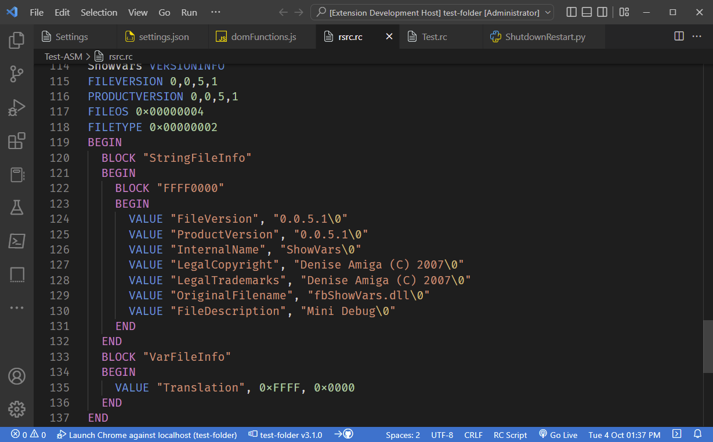
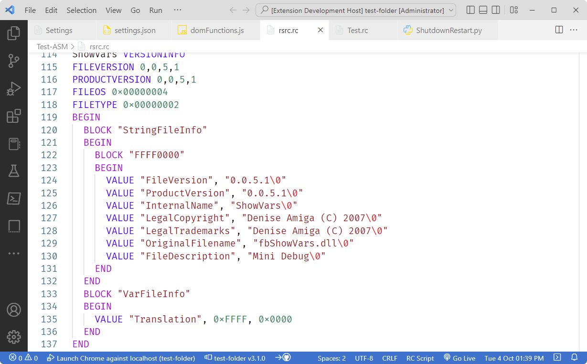
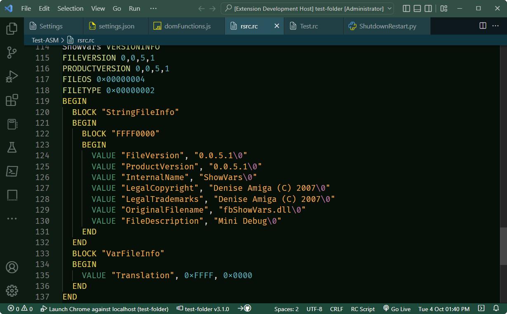

# RC Script
Syntax highlighter for RC Script files.

## Features
- Syntax highlighting for RC script files.
- Extensive code completions list.
- Open RC Script file in external RC file editor. See [Resource Editors](#resource-editors) for more info.
- Snippets
  - if
  - if-else
  - if-elif
  - if-elif-else

## Screenshots

Dark+ Theme

light+ Theme

[Emerald Sky Theme](https://marketplace.visualstudio.com/items?itemName=willasm.emerald-sky)

## Settings
- `RC Script - Full Path To Editor` (Optional external RC Script file editor)

## Commands
The following commands are available from the command pallette:
- `RC Script: Run External Script Editor` (Opens RC Script file in external editor)
- `RC Script: Set External Script Editor Location` (Sets External RC Script editor location)

## Release Notes
See the [Release Notes](RELEASE.md) for details.

## Resource Editors
Many development packages will include an RC script editor. For example Visual Studio has one as part of its development package. There are also a few third party RC editors as well. I personally have been using [ResEd (On Sourceforge)](https://sourceforge.net/p/fbedit/code/HEAD/tree/ResEd22/) by Ketil Olsen for over a decade now. It is a very capable program and is completely free. Download [ResEd.zip](https://sourceforge.net/p/fbedit/code/HEAD/tree/ResEd22/ResEd.zip?format=raw) from sourceforge if you want to try it out.

Note that while you can write your scripts in VSCode, I highly recommend using a dedicated editor for the bulk of your editing, then use VSCode for fine tuning your scripts.
